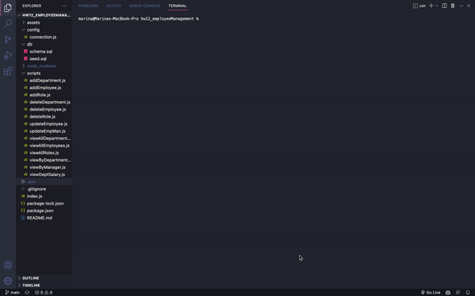

# hw12_employeeManagement

## Table of Contents 📚

- [Description](#description)
- [Preview](#preview)
- [Installation](#installation)
- [Usage](#usage)
- [Links](#links)

## Description 📋

MySQL command line application that allows users to manage company's employee database

## Preview 📸

## Installation 🔐

- Download repository
- Load schema.sql and seeds.sql through command line or Sequel Pro
- Create .env file
- SET DB_NAME to 'employees_db'
- SET DB_USER to 'YOUR-MYSQL-USERNAME'
- SET DB_PASSWORD to 'YOUR-MYSQL-PASSWORD'
- npm install
- node index.js

## Usage 🖥

MySQL application that allows users view and edit company's employee database system

## Links 💾

**[GitHub Link ✨](https://github.com/mxhuisken/hw12_employeeManagement)**

**[Video Demo ✨](https://youtu.be/N0RiZInNeuw)**
